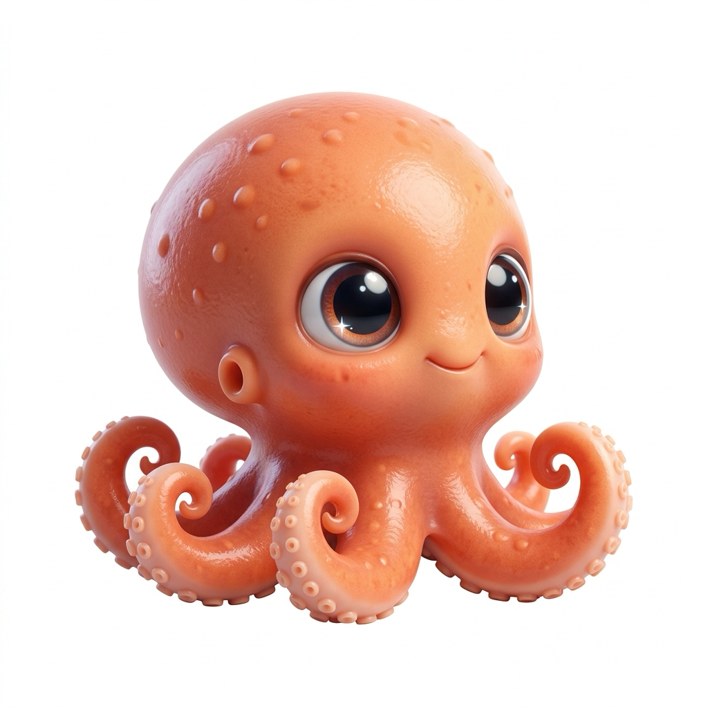
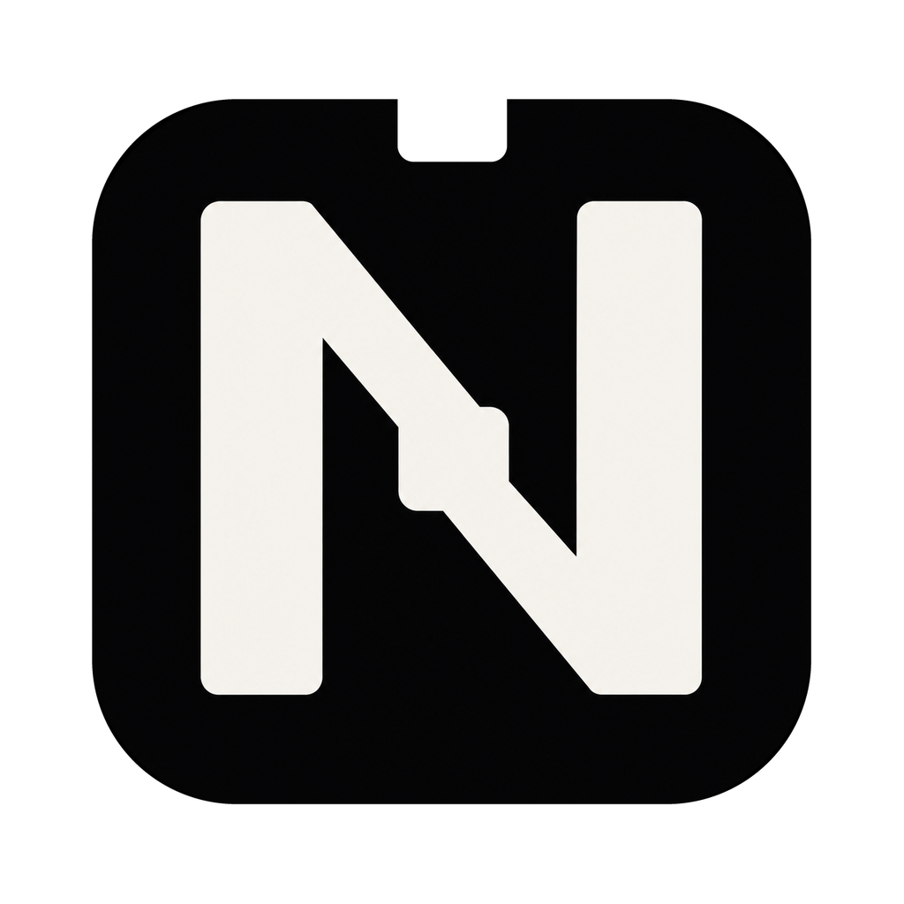
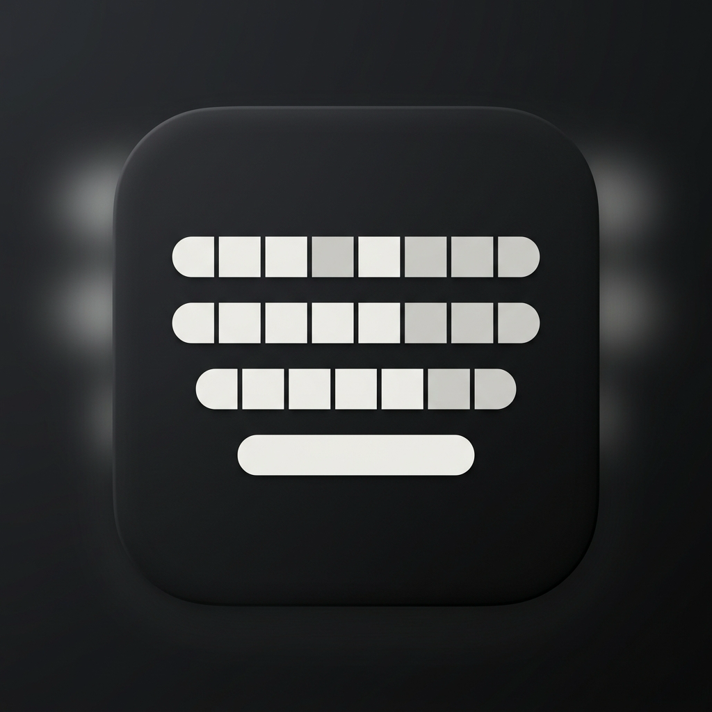
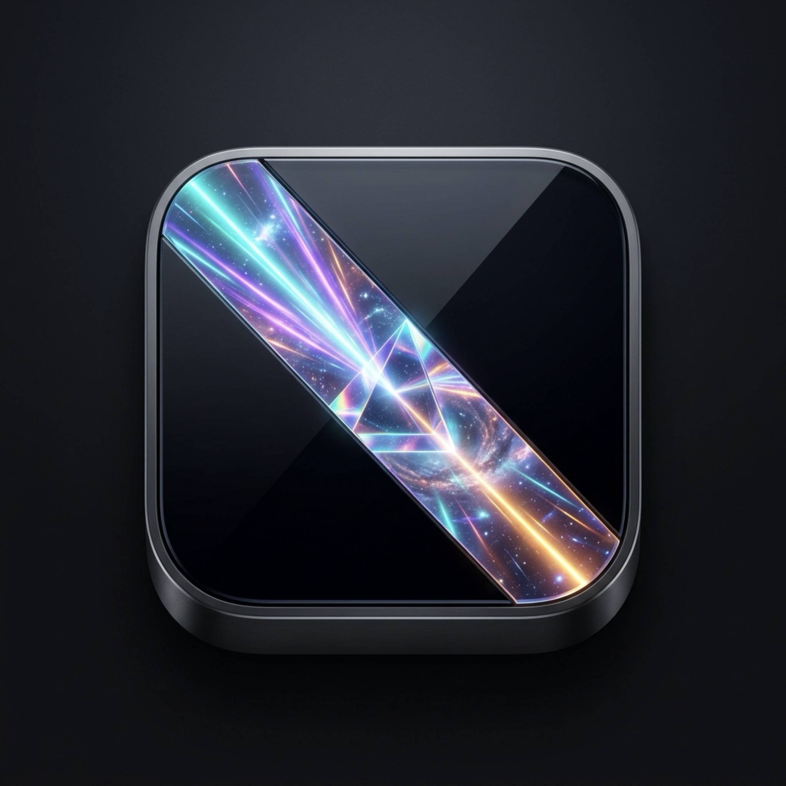

# Public project catalogue

Rescanned 2026-09-05. All 47 public owned repositories were inventoried and their available READMEs inspected. Descriptions summarize repository documentation, not an independent verification of every feature. Earlier work is retained; forks are identified.

| Identity | Repository | Type | Language | Description |
| :---: | :--- | :--- | :--- | :--- |
| — | [-claude-design-mcp-](https://github.com/Srimi1/-claude-design-mcp-) | Original | Rust | MCP server in Rust that connects Claude Code with claude.ai/design for automatic UI/UX assistance |
| — | [120fps-player](https://github.com/Srimi1/120fps-player) | Original | Kotlin | Android video player prototype; interpolation not yet implemented. |
| — | [Ai.Trader](https://github.com/Srimi1/Ai.Trader) | Original | Python | Market research and backtesting experiments. |
|  | [Anti](https://github.com/Srimi1/Anti) | Original | JavaScript | Browser-based AI career agent experiment. |
|  | [bots](https://github.com/Srimi1/bots) | Original | Swift | Early repository or limited documentation; see source for details. |
| — | [Claude](https://github.com/Srimi1/Claude) | Original | — | Early repository or limited documentation; see source for details. |
| — | [Claude_plugins](https://github.com/Srimi1/Claude_plugins) | Original | Python | Claude plugin experiments, including Eno. |
| — | [CodexBar](https://github.com/Srimi1/CodexBar) | Fork | Swift | CodexBar fork with added Sakana AI provider support, including API key validation, console-cookie quota tracking, 5-hour and weekly usage display, and native Sakana branding. |
|  | [Constitution](https://github.com/Srimi1/Constitution) | Original | Shell | AI tool governance and security workflow. |
| — | [ESG-Project-For-Claude](https://github.com/Srimi1/ESG-Project-For-Claude) | Original | — | Early repository or limited documentation; see source for details. |
| — | [First-A.I-Bot](https://github.com/Srimi1/First-A.I-Bot) | Original | Python | Early AI bot experiment. |
| — | [First-ai-agent](https://github.com/Srimi1/First-ai-agent) | Original | Python | An autonomous AI career agent that manages your job search pipeline. It intelligently scores roles based on resume fit, performs risk-reward analysis, and sends personalized cold emails. Features automated response monitoring and calendar scheduling for a disciplined, data-backed job search. |
| — | [friday](https://github.com/Srimi1/friday) | Original | Python | FRIDAY assistant experiment. |
| — | [Friday-001](https://github.com/Srimi1/Friday-001) | Original | — | Early repository or limited documentation; see source for details. |
|  | [Friday-core](https://github.com/Srimi1/Friday-core) | Original | JavaScript | Friday Core / Veronica desktop assistant runtime. |
|  | [Internet-speed-reader](https://github.com/Srimi1/Internet-speed-reader) | Original | Swift | Native macOS menu-bar network monitor with automatic live traffic and manual speed tests. Built with Swift 6. |
| — | [iphone-clipboard](https://github.com/Srimi1/iphone-clipboard) | Original | Swift | AIBoard: iPhone keyboard, clipboard, and AI writing experiment. |
| — | [iphone-wallpaper-resizer](https://github.com/Srimi1/iphone-wallpaper-resizer) | Original | HTML | Resize any photo to exact iPhone 17 screen dimensions — drag, drop, download. Zero dependencies, works offline. |
| — | [jarvis](https://github.com/Srimi1/jarvis) | Original | Python | Double-clap macOS workspace automation. |
|  | [LifeOs-Inbox](https://github.com/Srimi1/LifeOs-Inbox) | Original | TypeScript | Typed inbox triage capabilities and supporting services. |
| — | [line-bot-2](https://github.com/Srimi1/line-bot-2) | Original | TypeScript | Abandoned LINE plugin; agent dispatcher was not completed. |
|  | [muse-codex](https://github.com/Srimi1/muse-codex) | Original | Rust | Independent macOS compatibility gateway connecting Meta Muse Code to OpenAI models while preserving Muse tools, approvals, and sandboxing. |
| — | [Nagi-plugin](https://github.com/Srimi1/Nagi-plugin) | Original | — | Early repository or limited documentation; see source for details. |
| — | [NeoScholarAPI](https://github.com/Srimi1/NeoScholarAPI) | Original | Python | Early repository or limited documentation; see source for details. |
| — | [New-Jarvis](https://github.com/Srimi1/New-Jarvis) | Original | Python | Clap twice and JARVIS launches your full workspace. macOS voice assistant with internet check, music, and dev environment automation. |
| — | [New_Friday](https://github.com/Srimi1/New_Friday) | Original | HTML | FRIDAY static website. |
| — | [nightcrawler-v](https://github.com/Srimi1/nightcrawler-v) | Fork | — | Local AI powered red teamer on a phone |
|  | [Notch-hub](https://github.com/Srimi1/Notch-hub) | Original | Swift | Native, local-first macOS dashboard for the MacBook notch: Next Up, timers, media, calendar, reminders, clipboard, Focus, battery, and system status. |
| — | [oh-my-pi](https://github.com/Srimi1/oh-my-pi) | Fork | TypeScript | ⌥  AI Coding agent for the terminal — hash-anchored edits, optimized tool harness, LSP, Python, browser, subagents, and more |
| — | [P-Agents](https://github.com/Srimi1/P-Agents) | Original | Rust | Model-agnostic multi-agent AI harness in Rust — streaming ReAct loop, isolated sub-agents, gated tools, replayable sessions. Learning in public. |
|  | [P-Harness](https://github.com/Srimi1/P-Harness) | Original | TypeScript | TypeScript CLI research agent producing cited reports. |
| — | [potential-octo-dollop](https://github.com/Srimi1/potential-octo-dollop) | Original | Swift | Budget Guard: iPhone grocery budget tracker; Phase 1 complete. |
| — | [Project-Websites](https://github.com/Srimi1/Project-Websites) | Original | TypeScript | Early repository or limited documentation; see source for details. |
| — | [Prompt-Forge](https://github.com/Srimi1/Prompt-Forge) | Original | — | Turns messy ideas into production-ready AI prompts. Built for Claude, Codex, ChatGPT, Gemini — any AI. |
| — | [PYTHON](https://github.com/Srimi1/PYTHON) | Original | — | Early repository or limited documentation; see source for details. |
| — | [Research-Pro](https://github.com/Srimi1/Research-Pro) | Original | — | Plugin that will help you fro Research |
| — | [ruflo](https://github.com/Srimi1/ruflo) | Fork | TypeScript | 🌊 The leading agent meta-harness for Claude. Deploy intelligent multi-agent swarms, coordinate autonomous workflows, and build conversational AI systems. Features adaptive memory, self-learning swarm intelligence, RAG integration, and native Claude Code / Codex Integration |
| — | [Sera-Autonomous-Agent](https://github.com/Srimi1/Sera-Autonomous-Agent) | Original | Python | Autonomous personal agent with a self-improving Python core — typed-causal memory, on-device LoRA, encrypted approvals, and multi-channel presence. |
| — | [skills-copilot-codespaces-vscode](https://github.com/Srimi1/skills-copilot-codespaces-vscode) | Original | — | My clone repository |
| — | [Srimi1](https://github.com/Srimi1/Srimi1) | Original | — | Profile and contribution playground. |
|  | [The-Keyboard-project](https://github.com/Srimi1/The-Keyboard-project) | Original | Swift | An iOS keyboard extension that brings the native Android keyboard layout, key placement, and typing feel to iPhone. |
| — | [Time-travel-debugger](https://github.com/Srimi1/Time-travel-debugger) | Original | — | Repository placeholder; README contains only the title. |
| — | [tiny-tts](https://github.com/Srimi1/tiny-tts) | Fork | — | The Smallest English TTS Model with only 1M parameters |
| — | [TradingAgents](https://github.com/Srimi1/TradingAgents) | Fork | — | I am also joining |
|  | [trieonlabs.com](https://github.com/Srimi1/trieonlabs.com) | Original | CSS | Official site of Trieon Labs — liquid-glass landing page with live GitHub feed |
|  | [Veronica](https://github.com/Srimi1/Veronica) | Original | JavaScript | Floating AI assistant widget for macOS. |
|  | [Wallps](https://github.com/Srimi1/Wallps) | Original | Swift | Live video wallpapers for macOS and Windows. |
