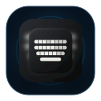
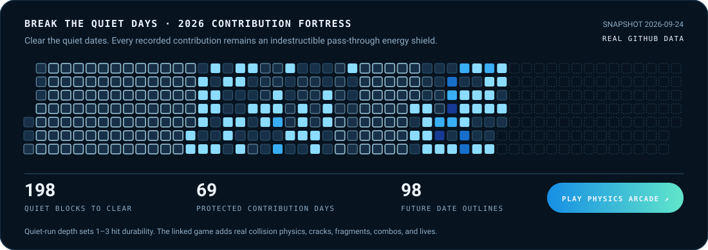

 

**[Selected work](#selected-work)** &nbsp; / &nbsp; **[Play Break the Quiet Days](https://srimi1.github.io/Srimi1/)** &nbsp; / &nbsp; **[How projects were selected](#what-counts-as-success)** &nbsp; / &nbsp; **[Say hello](https://linkedin.com/in/srijan-saanand)**

 

I’m **Srijan**, a developer and student in India. I build native products and agent systems, usually because I wanted the tool and could not find a version I trusted.

My rule is simple: **ship the useful part, test the risky part, and document the unfinished part.**

**Swift & SwiftUI** · **Rust** · **TypeScript** · **Python** 
macOS · iOS · agent runtimes · local-first tools

## Selected work

These are the four public projects that currently have the strongest evidence of success: a substantial working implementation, a reproducible path, meaningful quality gates, and claims that match what is actually shipped or verified.

<table>
<tr>
<td width="50%" valign="top">

### [NotchHub ↗](https://github.com/Srimi1/Notch-hub)
**The MacBook notch, put to work.**

A native, local-first dashboard for meetings, timers, media, clipboard, Focus, battery, and system status.

`SHIPPED` · `v0.9.0` · `44 test files` · `Universal DMG` · `CI + CodeQL`

The public DMG is ad-hoc signed and not notarized; that limitation is documented.

</td>
<td width="50%" valign="top">

### [P-Agents ↗](https://github.com/Srimi1/P-Agents)
**Agents that can delegate without losing the trail.**

A Rust multi-agent harness with streaming ReAct execution, gated tools, parallel subagents, and replayable sessions.

`VALIDATED TOOLING` · `5 Rust crates` · `Offline E2E` · `macOS + Linux CI` · `6 personas`

Validated from source and in CI; there is not yet a packaged public release.

</td>
</tr>
<tr>
<td width="50%" valign="top">

### [Internet Speed Reader ↗](https://github.com/Srimi1/Internet-speed-reader)
**Know what your connection is doing.**

A macOS menu-bar utility with live traffic, outage detection, manual capacity checks, and local history.

`SHIPPED` · `v1.1.0` · `187 tests` · `31 suites` · `DMG + SHA-256`

The released build is v1.1.0; newer work on the default branch is not presented here as a release.

</td>
<td width="50%" valign="top">

### [The Keyboard Project ↗](https://github.com/Srimi1/The-Keyboard-project)
**The Android typing feel, on iPhone.**

A native keyboard extension with familiar geometry, layered input, accessibility actions, and local clipboard history.

`PRE-RELEASE` · `50 Swift files` · `17/17 UI trials` · `CI-gated` · `Device gate open`

A successful engineering candidate, not a launched product; physical-device acceptance remains open.

</td>
</tr>
</table>

## Break the Quiet Days

**[Play the full physics arcade →](https://srimi1.github.io/Srimi1/)**

The board contains every date in **2026**. Dates with recorded GitHub contributions become permanent blue energy shields: light blue, medium blue, dark blue, and deep blue by contribution intensity. They pulse on contact and let the ball continue, so no quiet target can be trapped behind an indestructible pattern. Quiet days are the objective. Short gaps break in one hit; longer gaps crack over two hits; deep quiet runs take three. Future dates stay as outlines and are never mislabeled as inactivity.

The README preview is deliberately static. The linked game uses **Matter.js collision physics**, paddle steering, staged cracks, impact rings, fragments, combo scoring, three lives, keyboard/pointer/touch input, pause, and a saved best score.

A quiet calendar square means no recorded GitHub contribution, not “no work.” Studying, resting, private work, and offline building do not appear in this graph.

 

Profile graphics refresh from public GitHub data. Calendar totals follow GitHub’s contribution rules. Language bars count public original repositories by primary language; they are not percentages of commits.

## What counts as success

A project is selected when the public repository provides convincing evidence across the dimensions below. Stars and recency are not treated as proof by themselves.

| Dimension | What I looked for |
| :--- | :--- |
| **Working implementation** | Substantial source that fulfills the central claim rather than a plan, shell, or prompt alone. |
| **Proof** | A release, runnable demo, reproducible offline path, screenshots, or concrete validation artifacts. |
| **Quality** | Automated tests, CI, security checks, deterministic end-to-end validation, or release checksums. |
| **Reproducibility** | Clear requirements, install/build instructions, pinned dependencies, and an understandable project structure. |
| **Claim integrity** | Shipped work is labeled shipped; source-validated work and pre-release work are labeled honestly. |

How this profile stays current

The contribution data and generated profile graphics refresh through GitHub Actions. The avatar at `docs/assets/avatar.png` is intentionally preserved. The four-project selection is curated rather than generated from stars or repository count, so experimental work cannot silently enter the showcase.

---

**Build the proof. Keep the limits honest.**

[GitHub](https://github.com/Srimi1) &nbsp; · &nbsp; [LinkedIn](https://linkedin.com/in/srijan-saanand) &nbsp; · &nbsp; [Play Break the Quiet Days](https://srimi1.github.io/Srimi1/)

