 

**[The workshop](#the-workshop)** &nbsp; / &nbsp; **[Play Quiet Days Quest](https://srimi1.github.io/Srimi1/)** &nbsp; / &nbsp; **[All projects](#the-full-journey)** &nbsp; / &nbsp; **[Say hello](https://linkedin.com/in/srijan-saanand)**

 

I’m **Srijan**, a developer and student in India. I build native desktop and mobile apps, mostly things I wanted to exist and couldn’t find, and the agent tooling that helps me build them faster.

The habit I care about most: **ship it properly.** Signed builds, quality gates, useful release notes, and documentation that is honest about what works and what is still an experiment.

**Swift & SwiftUI** · **Rust** · **TypeScript** · **Python** · **Kotlin** 
macOS · iOS · Android · agent tools & MCP

## The workshop

### Selected work

A few projects that best show what I build: native interfaces, useful everyday tools, and the systems behind agents.

<table>
<tr>
<td width="50%" valign="top">

#### [NotchHub ↗](https://github.com/Srimi1/Notch-hub)
**The MacBook notch, put to work.**

Meetings, clipboard, media, Focus, and system status in a local-first AppKit and SwiftUI dashboard.

`Native macOS` · Native desktop engineering

</td>
<td width="50%" valign="top">

#### [Wallps ↗](https://github.com/Srimi1/Wallps)
**Give the desktop a little life.**

Live video wallpapers, a local library, and battery-aware playback. SwiftUI / AVFoundation on Mac; Electron on Windows.

`macOS + Windows` · Cross-platform release

</td>
</tr>
<tr>
<td width="50%" valign="top">

#### [Internet Speed Reader ↗](https://github.com/Srimi1/Internet-speed-reader)
**Know what your connection is doing.**

Live traffic in the menu bar, manual speed tests, and outage detection. Public builds are ad-hoc signed, not notarized.

`Swift · macOS` · Everyday utility

</td>
<td width="50%" valign="top">

#### [Muse Codex ↗](https://github.com/Srimi1/muse-codex)
**A new model connection. The same tools.**

A compatibility gateway that preserves Muse’s tools, approvals, and sandbox. Source-only, Apple silicon, pinned Muse version.

`Rust · experimental` · Runtime integration

</td>
</tr>
<tr>
<td width="50%" valign="top">

#### [LifeOS Inbox ↗](https://github.com/Srimi1/LifeOs-Inbox)
**An inbox an agent can reason about.**

Typed triage capabilities for follow-ups, obligations, and daily briefs, with services for persistence and scheduling.

`TypeScript · agents` · Agent-first architecture

</td>
<td width="50%" valign="top">

#### [The Keyboard Project ↗](https://github.com/Srimi1/The-Keyboard-project)
**The Android typing feel, on iPhone.**

AOSP-inspired key geometry and multi-item clipboard history inside an iOS keyboard extension.

`Swift · iOS` · Native mobile engineering

</td>
</tr>
</table>

### Agents, harnesses, and experiments

| Project | What I’m building | Where it stands |
| :--- | :--- | :--- |
| **[P-Agents](https://github.com/Srimi1/P-Agents)** | A Rust agent harness with streaming, isolated sub-agents, gated tools, and replayable sessions. | Learning and building in public. |
| **[P-Harness](https://github.com/Srimi1/P-Harness)** | A TypeScript research CLI: deconstruct, explore, deep-read, and produce cited reports. | Research tooling. |
| **[Sera](https://github.com/Srimi1/Sera-Autonomous-Agent)** | ReAct CLI, SQLite/FTS5 memory, provider adapters, approvals, and context compression. | First five phases of a 100-phase plan complete. |
| **[AI.Trader](https://github.com/Srimi1/Ai.Trader)** | Multi-agent market research, alternative data, backtesting, and portfolio experiments. | Research; not investment advice. |
| **[AI Constitution](https://github.com/Srimi1/Constitution)** | A shared governance layer for my AI tools, with secret checks and launch safeguards. | Workflow infrastructure. |
| **[120fps Player](https://github.com/Srimi1/120fps-player)** | An Android player exploring on-device motion interpolation. | Player and diagnostics run; **frame interpolation is not implemented**. |
| **[Budget Guard](https://github.com/Srimi1/potential-octo-dollop)** | An iPhone grocery budget tracker with integer-paise totals and weight-based entry. | Phase 1 complete; scanning and Live Activities are planned. |

### Small tools, real use

[**Prompt Forge**](https://github.com/Srimi1/Prompt-Forge) turns rough ideas into structured AI prompts. 
[**claude-design-mcp**](https://github.com/Srimi1/-claude-design-mcp-) prepares project context for Claude Design through a Rust MCP server. 
[**iPhone Wallpaper Resizer**](https://github.com/Srimi1/iphone-wallpaper-resizer) is a drag-and-drop, offline HTML utility. 
[**Research Pro**](https://github.com/Srimi1/Research-Pro) packages academic research workflows as skills and commands. 
[**New Jarvis**](https://github.com/Srimi1/New-Jarvis) starts a macOS workspace with a double clap. 
[**Trieon Labs**](https://github.com/Srimi1/trieonlabs.com) is the home for the things I’m building.

### More from the workshop

Existing logos and project artwork from the rest of the collection.

<table><tr>
<td align="center" width="25%"><a href="https://github.com/Srimi1/P-Harness"> <strong>P-Harness</strong></a></td>
<td align="center" width="25%"><a href="https://github.com/Srimi1/Constitution"> <strong>AI Constitution</strong></a></td>
<td align="center" width="25%"><a href="https://github.com/Srimi1/Veronica"> <strong>Veronica</strong></a></td>
<td align="center" width="25%"><a href="https://github.com/Srimi1/Friday-core"> <strong>Friday Core</strong></a></td>
</tr><tr>
<td align="center" width="25%"><a href="https://github.com/Srimi1/trieonlabs.com"> <strong>Trieon Labs</strong></a></td>
<td align="center" width="25%"><a href="https://github.com/Srimi1/Anti"> <strong>Nagi / Anti</strong></a></td>
<td align="center" width="25%"><a href="https://github.com/Srimi1/bots"> <strong>DockBuddy</strong></a></td>
</tr></table>

## A year, one square at a time

**[Play Quiet Days Quest →](https://srimi1.github.io/Srimi1/)** 
Roll the dice or start the automatic tour. My mini avatar winds through the quiet squares, passing over contribution days. A small corner chart keeps track of active days, quiet days, and your journey.

An empty square means no recorded GitHub contributions, not “no work.” Studying, resting, and building offline belong in the story too. The README plays an animation; the linked playground is interactive.

 

Charts refresh daily through GitHub Actions. Calendar totals follow GitHub’s contribution rules. Language bars count public original repositories by their primary language, excluding forks; they are not percentages of commits.

## The full journey

The earlier assistants, prototypes, plugins, and forks are still here. **[Browse the complete public project catalogue](CATALOG.md)** for all 47 repositories found in the September 2026 rescan, including the Friday / Veronica lineage and the experiments that never reached a finished release. Forks are labelled as forks.

Profile history & how this page works

The [previous README](README.previous.md) is preserved as a historical snapshot. The redesigned profile is generated from public repository metadata and the contribution calendar. The [maintenance guide](MAINTENANCE.md) explains the data, animation, game controls, and daily refresh workflow.

---

**Most of what’s here started because I wanted the thing to exist.** 
If one of them is useful to you too, that’s the best part.

[GitHub](https://github.com/Srimi1) &nbsp; · &nbsp; [LinkedIn](https://linkedin.com/in/srijan-saanand) &nbsp; · &nbsp; [Play the mini game](https://srimi1.github.io/Srimi1/)

