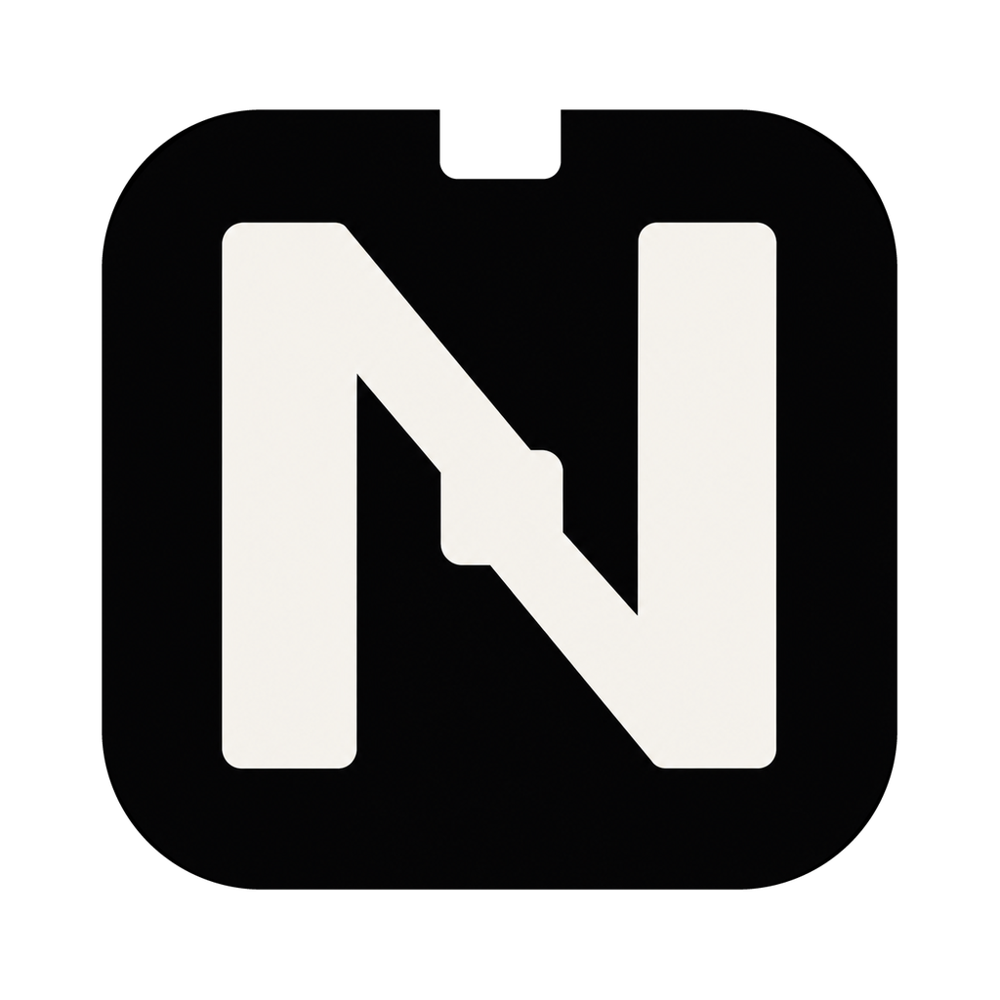
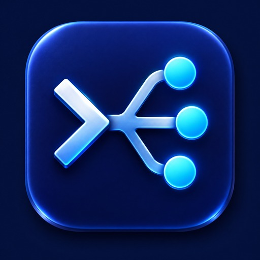
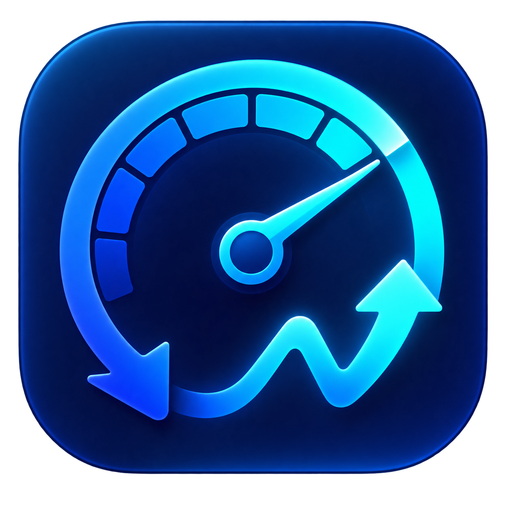
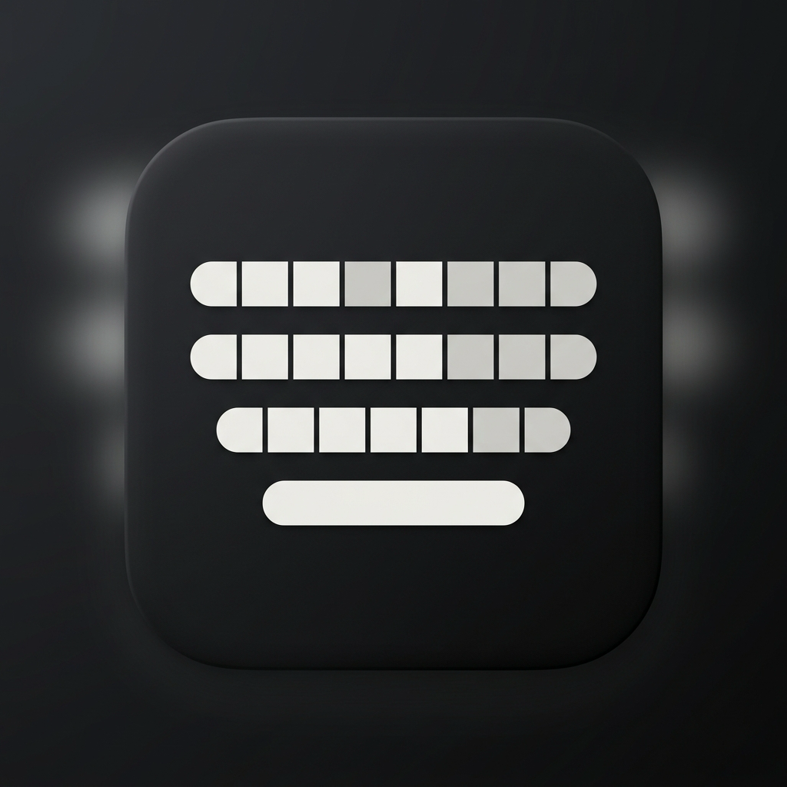

SRIJAN × SARAH · COFFEE, CODE & A WORLD WE BUILD TOGETHER

 

I’m **Srijan**, a developer and student in India. I build native apps and agent systems — mostly things I wanted to exist.

Meet **Sarah**, my AI companion from my Sera project. In **Code Together**, we start with coffee and code, then jump across a city built from my real GitHub contribution days. A shared build, a little explosion of light, and a hug bring us home.

The story runs automatically here. Each platform is an active day from the latest 30 days; its glow follows the contribution intensity. Our characters move independently through an actual autopilot simulation, which renders this looping animation for the README. The calendar and story refresh daily.

**Swift & SwiftUI** · **Rust** · **TypeScript** · **Python** 
macOS · iOS · Android · agent systems

[Visit our coding world ↗](https://srimi1.github.io/Srimi1/) · [Say hello ↗](https://linkedin.com/in/srijan-saanand)

## Selected work

<table>
<tr>
<td width="50%" valign="top">

### [NotchHub ↗](https://github.com/Srimi1/Notch-hub)

**The MacBook notch, put to work.**

A local-first dashboard for meetings, timers, media, clipboard, Focus, battery, and system status.

`SHIPPED` · `Swift` · `macOS` · `Universal DMG`

The public build is ad-hoc signed and not notarized.

</td>
<td width="50%" valign="top">

### [P-Agents ↗](https://github.com/Srimi1/P-Agents)

**Agents that delegate without losing the trail.**

A Rust multi-agent harness with streaming execution, gated tools, parallel agents, and replayable sessions.

`VALIDATED TOOLING` · `Rust` · `Offline E2E` · `CI`

Validated from source and in CI; no packaged public release yet.

</td>
</tr>
<tr>
<td width="50%" valign="top">

### [Internet Speed Reader ↗](https://github.com/Srimi1/Internet-speed-reader)

**Know what your connection is doing.**

Live menu-bar traffic, outage detection, manual capacity checks, and local history.

`SHIPPED` · `Swift` · `macOS` · `DMG + SHA-256`

</td>
<td width="50%" valign="top">

### [The Keyboard Project ↗](https://github.com/Srimi1/The-Keyboard-project)

**The Android typing feel, on iPhone.**

A native keyboard extension with familiar geometry, layered input, and local clipboard history.

`PRE-RELEASE` · `Swift` · `iOS` · `CI-gated`

Physical-device acceptance remains open.

</td>
</tr>
</table>

## The build rhythm

Refreshed from public GitHub data. A quiet calendar square can mean studying, resting, private work, or offline building. Language bars count repositories by primary language.

---

**A little world on the internet. Built with a lot of heart.**

[Code Together](https://srimi1.github.io/Srimi1/) &nbsp; · &nbsp; [GitHub](https://github.com/Srimi1) &nbsp; · &nbsp; [LinkedIn](https://linkedin.com/in/srijan-saanand)

