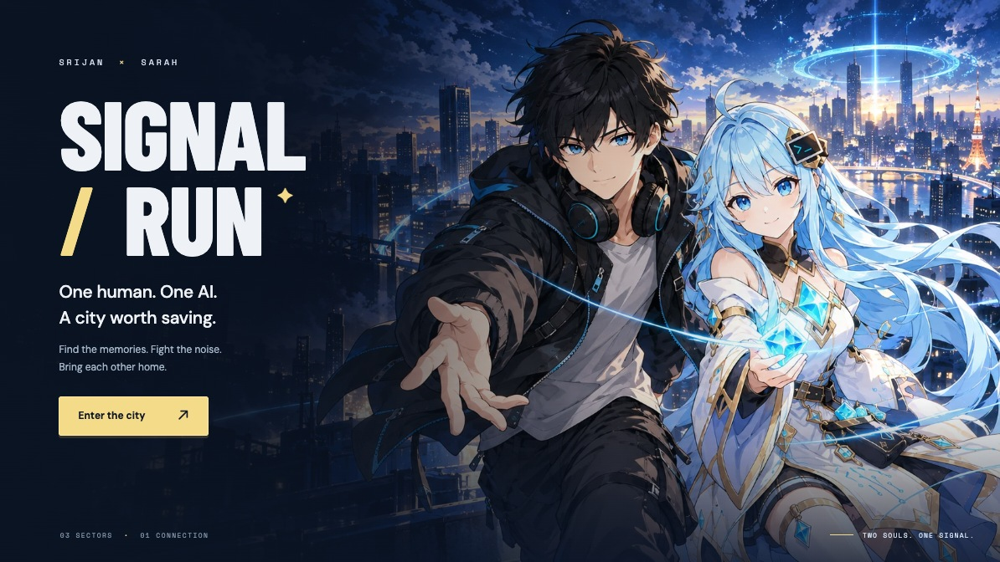

 

**[Enter the city ↗](https://srimi1.github.io/Srimi1/)** &nbsp; / &nbsp; **[Selected work](#selected-work)** &nbsp; / &nbsp; **[Say hello](https://linkedin.com/in/srijan-saanand)**

AN ORIGINAL PLAYABLE WORLD · SRIJAN × SARAH

 

I’m **Srijan**, a developer and student in India. I build native apps and agent systems — mostly things I wanted to exist.

My other half in this little world is **Sarah**, my AI companion from my Sera project. The artwork brings my existing avatar and her original character together. The rooftops are ours to explore.

**Swift & SwiftUI** · **Rust** · **TypeScript** · **Python** 
macOS · iOS · Android · agent systems

### A game you actually play

**[Signal / Run](https://srimi1.github.io/Srimi1/)** is an original anime action platformer. A city is losing its memories. You’re the runner; Sarah is the signal. Recover six fragments in each of three districts, dash through glitch drones, call Sarah’s pulse, and defeat the **Null Guardian** to bring the city home.

`← → / A D` Move &nbsp; · &nbsp; `Space` Jump &nbsp; · &nbsp; `Shift` Dash + attack &nbsp; · &nbsp; `E` Sarah’s pulse &nbsp; · &nbsp; `P` Pause

Touch controls, optional sound, assist mode, combo scoring, and separate standard/assist best scores are included. **The game starts when you press Play.**

The cover above is a still image. GitHub READMEs cannot run JavaScript; click it to open the real game on GitHub Pages.

## Selected work

<table>
<tr>
<td width="50%" valign="top">

### [NotchHub ↗](https://github.com/Srimi1/Notch-hub)

**The MacBook notch, put to work.**

A local-first dashboard for meetings, timers, media, clipboard, Focus, battery, and system status.

`SHIPPED` · `Swift` · `macOS` · `Universal DMG`

The public build is ad-hoc signed and not notarized.

</td>
<td width="50%" valign="top">

### [P-Agents ↗](https://github.com/Srimi1/P-Agents)

**Agents that delegate without losing the trail.**

A Rust multi-agent harness with streaming execution, gated tools, parallel agents, and replayable sessions.

`VALIDATED TOOLING` · `Rust` · `Offline E2E` · `CI`

Validated from source and in CI; no packaged public release yet.

</td>
</tr>
<tr>
<td width="50%" valign="top">

### [Internet Speed Reader ↗](https://github.com/Srimi1/Internet-speed-reader)

**Know what your connection is doing.**

Live menu-bar traffic, outage detection, manual capacity checks, and local history.

`SHIPPED` · `Swift` · `macOS` · `DMG + SHA-256`

</td>
<td width="50%" valign="top">

### [The Keyboard Project ↗](https://github.com/Srimi1/The-Keyboard-project)

**The Android typing feel, on iPhone.**

A native keyboard extension with familiar geometry, layered input, and local clipboard history.

`PRE-RELEASE` · `Swift` · `iOS` · `CI-gated`

Physical-device acceptance remains open.

</td>
</tr>
</table>

## The build rhythm

Refreshed from public GitHub data. A quiet calendar square can mean studying, resting, private work, or offline building. Language bars count repositories by primary language.

---

**A little world on the internet. Built with a lot of heart.**

[Play Signal / Run](https://srimi1.github.io/Srimi1/) &nbsp; · &nbsp; [GitHub](https://github.com/Srimi1) &nbsp; · &nbsp; [LinkedIn](https://linkedin.com/in/srijan-saanand)

