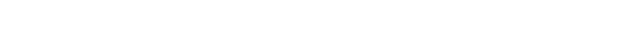
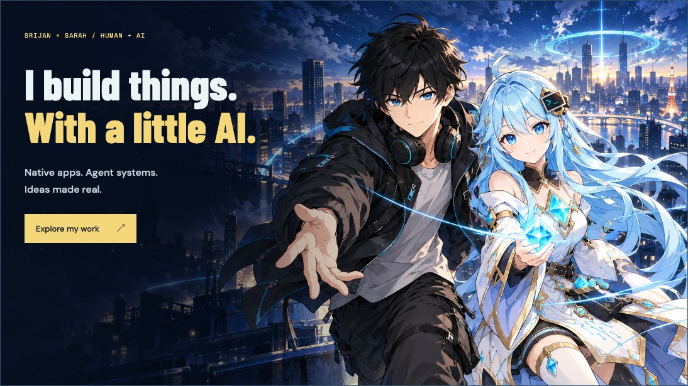

# Hi, I'm Srijan 👋

Developer & student in India · Native apps · Agent systems

[My projects](#selected-work) · [Portfolio](https://srimi1.github.io/Srimi1/) · [LinkedIn](https://linkedin.com/in/srijan-saanand)

SRIJAN × SARAH · HUMAN + AI

I build native apps and agent systems—mostly things I wanted to exist. **Sarah** is my AI companion from **Sera**. The artwork combines my original avatar with her character.

### Tools I use

   

**Swift & SwiftUI** · **Rust** · **TypeScript** · **Python** 
macOS · iOS · Android · agent systems

## Selected work

<table>
<tr>
<td width="50%" valign="top">

### [NotchHub ↗](https://github.com/Srimi1/Notch-hub)

**The MacBook notch, put to work.**

A local-first dashboard for meetings, timers, media, clipboard, Focus, battery, and system status.

`SHIPPED` · `Swift` · `macOS` · `Universal DMG`

The public build is ad-hoc signed and not notarized.

</td>
<td width="50%" valign="top">

### [P-Agents ↗](https://github.com/Srimi1/P-Agents)

**Agents that delegate without losing the trail.**

A Rust multi-agent harness with streaming execution, gated tools, parallel agents, and replayable sessions.

`VALIDATED TOOLING` · `Rust` · `Offline E2E` · `CI`

Validated from source and in CI; no packaged public release yet.

</td>
</tr>
<tr>
<td width="50%" valign="top">

### [Internet Speed Reader ↗](https://github.com/Srimi1/Internet-speed-reader)

**Know what your connection is doing.**

Live menu-bar traffic, outage detection, manual capacity checks, and local history.

`SHIPPED` · `Swift` · `macOS` · `DMG + SHA-256`

</td>
<td width="50%" valign="top">

### [The Keyboard Project ↗](https://github.com/Srimi1/The-Keyboard-project)

**The Android typing feel, on iPhone.**

A native keyboard extension with familiar geometry, layered input, and local clipboard history.

`PRE-RELEASE` · `Swift` · `iOS` · `CI-gated`

Physical-device acceptance remains open.

</td>
</tr>
</table>

## The build rhythm

Refreshed daily from public GitHub data. Quiet days can mean studying, resting, private work, or building offline. Language bars count repositories by primary language.

---

[Srijan × Sarah](https://srimi1.github.io/Srimi1/) · [GitHub](https://github.com/Srimi1) · [LinkedIn](https://linkedin.com/in/srijan-saanand)

